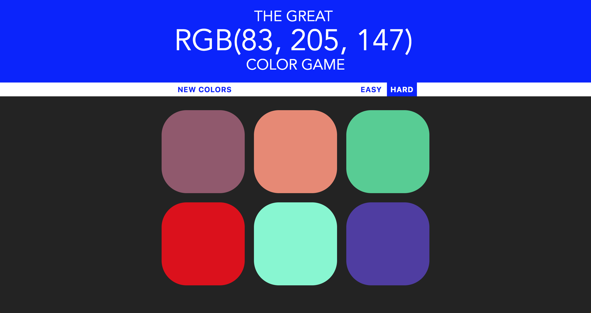

# RGB-Guessing-Game

* A simple RGB guessing game built in JavaScript.
* Two Levels of difficulty: Easy (3 colors) and Hard (6 colors).

### Master your RGB color capacity!

##### Demo: https://hfakhreddine86.github.io/RGB-Guessing-Game/

